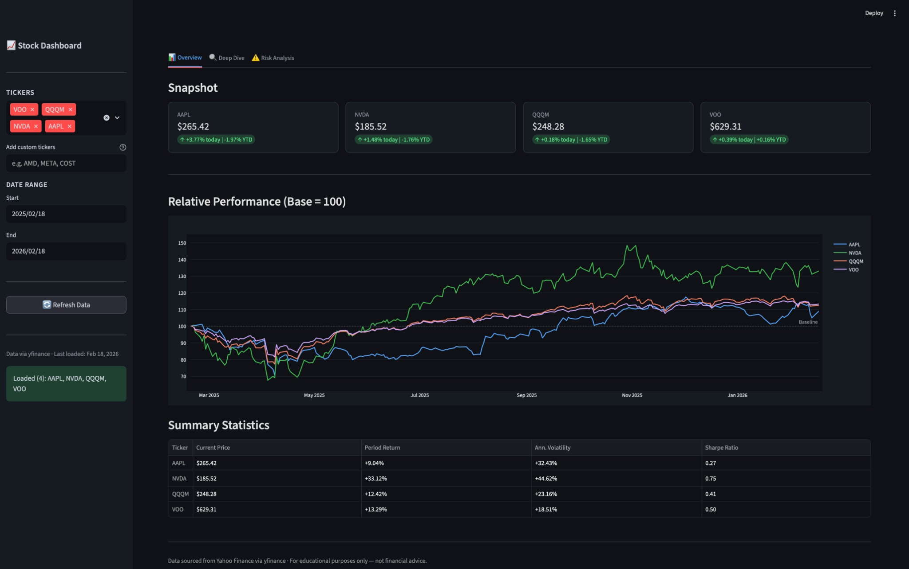
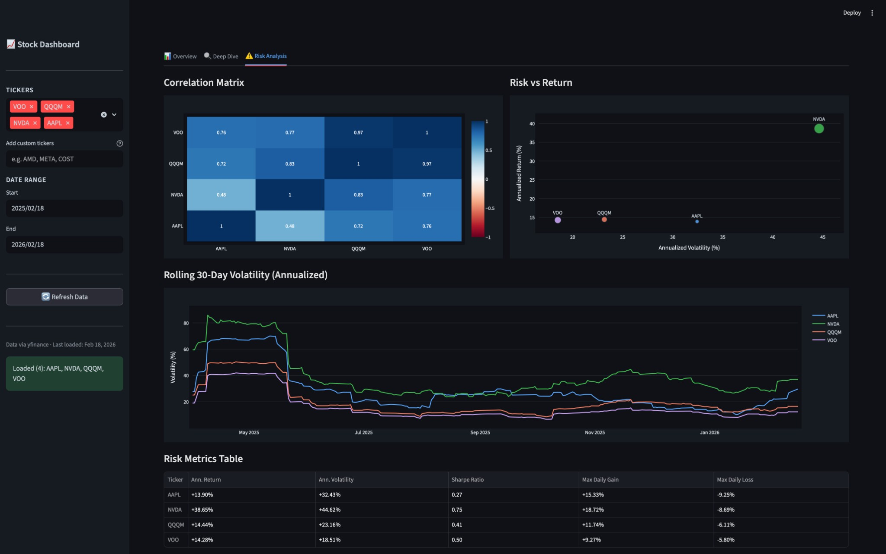
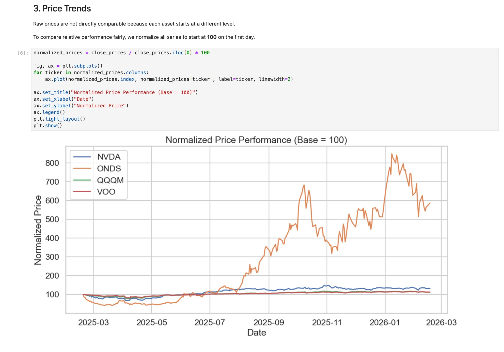

## 📈 Stock Market Analysis & Dashboard

[](https://www.python.org/)
[](https://streamlit.io/)
[](#license)

An end-to-end stock analysis project that combines a reproducible research notebook with an interactive Streamlit dashboard. It pulls historical market data from Yahoo Finance via `yfinance`, computes key performance and risk metrics (returns, volatility, correlations, Sharpe ratio, moving averages), and visualizes insights with clean, recruiter-friendly charts.

## Live App

Use the hosted dashboard for the fastest experience:

**https://stock-analysis-dashboard-0nut.streamlit.app**

## Features

### Notebook analysis (`notebooks/`)

- **Data collection pipeline** using reusable modules in `src/` (multi-ticker OHLCV via `yfinance`)
- **Exploratory analysis** of price trends and relative performance
- **Return & risk metrics**: daily/cumulative returns, annualized volatility, Sharpe ratio
- **Diversification insights** via correlation analysis
- **Technical indicators**: 20/50-day simple moving averages (SMA)

### Dashboard (`dashboard/app.py`)

- **Multi-ticker comparison** with normalized “base = 100” performance charts
- **Snapshot metrics**: current price, daily change, YTD return
- **Single-stock deep dive**: candlestick chart + SMA overlays and volume chart
- **Risk analysis**:
  - correlation matrix heatmap
  - risk vs. return scatter (with Sharpe-sized markers)
  - rolling 30-day annualized volatility
- **Fast UX** via Streamlit caching and a refresh action

## Tech Stack

- **Python**
- **yfinance**
- **pandas**
- **numpy**
- **plotly**
- **streamlit**
- **scikit-learn**
- **seaborn**

## Screenshots

### Dashboard Overview



Interactive dashboard showing stock performance, metrics, and relative performance chart.

### Risk Analysis



Correlation matrix, risk vs return scatter plot, and rolling volatility analysis.

### Jupyter Notebook Analysis



Detailed exploratory data analysis with code and visualizations.

## Installation & Setup

If you only want to use the app, open the live link above.  
Use local setup if you want to run the project from source, reproduce results, or develop new features.

### 1) Clone the repository

```bash
git clone https://github.com/<your-username>/stock-analysis-dashboard.git
cd stock-analysis-dashboard
```

### 2) Install dependencies

```bash
python -m venv .venv
source .venv/bin/activate   # macOS/Linux
# .venv\Scripts\activate    # Windows (PowerShell)

pip install -r requirements.txt
```

### 3) Run the dashboard

```bash
streamlit run dashboard/app.py
```

### 4) Run the notebook (optional)

```bash
jupyter notebook
```

## Deploy to Streamlit Community Cloud (Free Hosting)

1. **Push your code to GitHub** (Streamlit Cloud deploys from a public repo on the free tier).
2. Create an account at **Streamlit Community Cloud** and click **New app**.
3. Select your repository + branch.
4. Set the **Main file path** to:
   - `dashboard/app.py`
5. Click **Deploy**.

Notes:
- If you need to pin a Python version on Streamlit Cloud, add a `runtime.txt` (example: `python-3.10.13`).
- Streamlit Cloud will install dependencies from `requirements.txt` automatically.

## Future Improvements

- **ML price prediction** (feature engineering + backtesting, not just point forecasts)
- **News sentiment analysis** to contextualize price movement (e.g., headline polarity + event windows)
- **Portfolio optimization** (efficient frontier, constraints, and rebalancing simulations)

## License

This project is licensed under the **MIT License**. See the [MIT License](https://opensource.org/licenses/MIT) for details.

## Create a GitHub Repo and Push This Project

1. Create a new empty repository on GitHub (for example, `stock-analysis-dashboard`) and do not initialize it with a README, license, or `.gitignore`.
2. Add your GitHub repository as the remote:

```bash
git remote add origin https://github.com/<your-username>/stock-analysis-dashboard.git
```

3. Push your code to GitHub:

```bash
git push -u origin main
```
